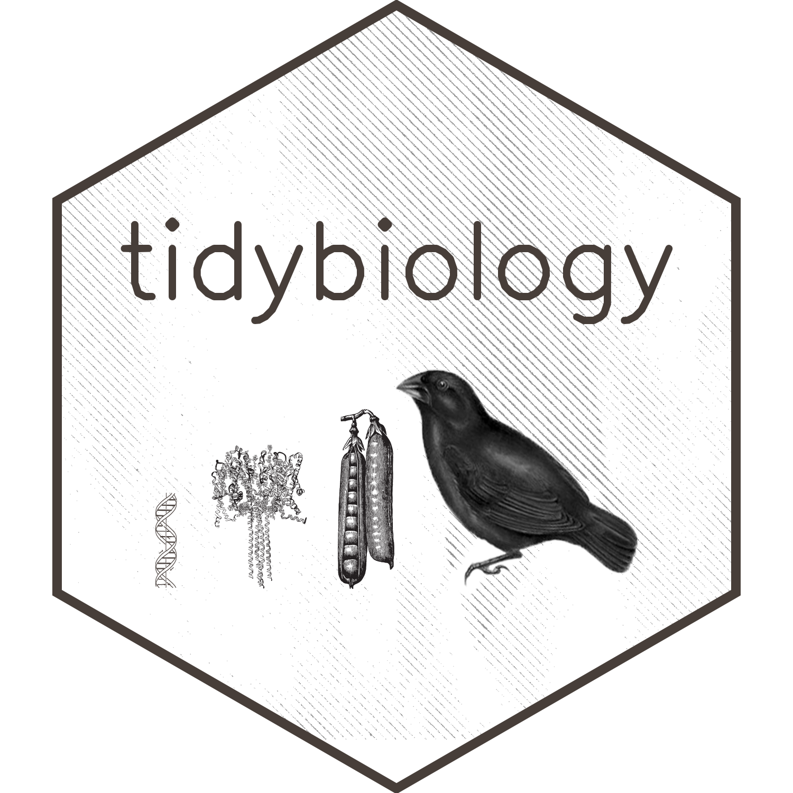

```{r context="setup", include=FALSE}
#guide is here
# https://rmarkdown.rstudio.com/authoring_shiny_prerendered.html
# https://pkgs.rstudio.com/learnr/articles/publishing.html

#install libraries
library(tidyverse)
library(shiny)
library(learnr)
library(DT)

knitr::opts_chunk$set(echo = FALSE)
```

```{r data, include=FALSE}
object_table <- readRDS("object_table.Rds")
```

```{r}
#all images must be in images dir
HTML("<center><br><br></center>")
```

```{r, context="render"}
# Create output for our router in main UI of Shiny app.
fluidPage(
  tagList(
    tags$head(
      tags$meta(charset="UTF-8"),
      tags$meta(name="title", content="tidybiology.org"),
      tags$meta(name="description", content="Learning datascience")
    ),
    tags$div(
      tags$br(),
      HTML(paste("<center>Tidybiology is a resource developed by the <a href='http://www.hirscheylab.org' style='color:black;'>Hirschey Lab</a> for learning data science.</center>")), 
      tags$br(),
      tags$br()),
    HTML("<center>"),
    HTML("<a href='http://module.tidybiology.org/1'>Get Started</a>"),
    ", ", 
    HTML("<a href='http://module.tidybiology.org/map'>browse the tracks</a>"),
    ", ",
    HTML("<a href='http://module.tidybiology.org/quiz'>test yourself</a>"), # placeholder
    ", or",
    actionLink(inputId = "search_click", "search the learning materials"),
    HTML("</center>"),
    conditionalPanel(condition = paste0("input['search_click'] != 0"), 
                     tags$br(),
                     h4("Learning Materials"),
                     DT::dataTableOutput(outputId = "object_table"))
    
  )
)
```


```{r, context="server"}
observeEvent(input$search_click, {})   #event to store the 'click'

output$object_table <- DT::renderDataTable({
  DT::datatable(object_table %>%
                  dplyr::select(Title = title, 
                                Level = level, 
                                Language = language, 
                                Type = type, 
                                'Included in' = included_in),
                escape = FALSE,
                options = list(pageLength = 10))
  
  
}) 
```

